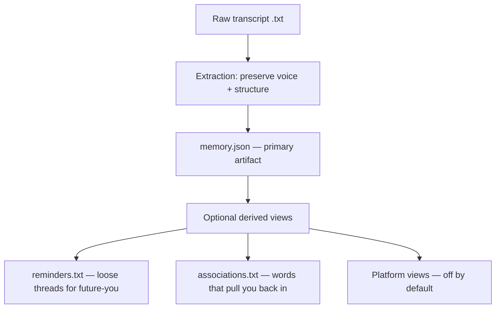

# Roadmap: Artist Memory, Not Marketing Copy

## North Star

Creative Pipeline exists to preserve what an artist was thinking when they made a piece — not to produce descriptions you can copy and paste.

Inputs are transcripts the artist recorded about their own work: spoken, messy, contradictory, repetitive, unfinished. That rawness is the point. Extraction should honor the transcript as a primary artifact, not sand it into tidy ideas for social posts.

**Success looks like:** opening an output months later and recognizing your own mind at the moment you made the work — including the parts that did not resolve.

**Success does not look like:** a polished caption, a coherent artist statement, or SEO-ready tags ready to ship.

---

## Principles (non-negotiable)

1. **Preserve voice.** Favor the artist's phrasing over paraphrase. When in doubt, quote or stay close to the spoken line.
2. **Keep contradiction.** If the artist says two incompatible things, both belong in the output. Do not reconcile them.
3. **Keep uncertainty.** "I think," "maybe," "I'm not sure," "or something like that" are signal, not noise.
4. **Keep tangents.** Side paths often hold the real memory. Tag them as tangents; do not delete them for focus.
5. **No invention.** Nothing in the output that cannot be traced to the transcript. No added symbolism, backstory, or marketing framing.
6. **Reminder, not publication.** Outputs are notes-to-future-self. Readable, but not performative.

---

## Where we are today

The current pipeline (`scripts/captions_pipeline.py`) is built for a different goal:

| Layer | Current behavior | Conflict with North Star |
|-------|------------------|--------------------------|
| `agents/transcript.yaml` | 8–12 polished bullet fragments; "remove filler, repetition, and drift" | Smooths away the raw transcript |
| `agents/*.yaml` (platform) | 2–3 sentence captions per network | Copy-paste publishing copy |
| `agents/tags.yaml` | Single-word SEO-style tags | Search optimization, not memory |
| Ollama defaults | `temperature: 0.4`, `num_predict: 120` | Short, conservative outputs that compress voice |
| Examples | Coherent, unified bullet lists | No contradictions, no hesitation, no mess |

The filename `transcript_analysis.json` and the `captions_pipeline` name both imply polish and distribution. The architecture (transcript → analysis → tags → platform captions) assumes analysis is an intermediate clean layer. That middle layer is exactly what we need to stop sanitizing.

---

## Target architecture



**Primary artifact:** `memory.json` (rename from `transcript_analysis.json`) — structured extraction that stays close to the source.

**Derived views** are secondary and optional. They read from `memory.json`, never from a flattened summary chain. They must not introduce ideas absent from the extraction.

---

## Phase 1 — Reframe the project

**Goal:** Align naming, docs, and examples with the North Star before changing behavior.

- [ ] Rewrite `README.md` and `docs/getting-started.md` around artist memory, not caption generation.
- [ ] Add a short `docs/philosophy.md` expanding the principles above with good/bad output examples.
- [ ] Mark platform caption configs (`facebook`, `instagram`, etc.) as **legacy / opt-in** in docs.
- [ ] Replace `examples/` with at least one deliberately messy transcript and extraction that shows contradictions and quoted voice preserved.
- [ ] Rename pipeline entry points in docs (keep `make` working; introduce `run-extract` or similar alias when code catches up).

**Exit criteria:** A new contributor reads the docs and understands that polished captions are explicitly out of scope.

---

## Phase 2 — Redesign extraction (core work)

**Goal:** Replace polished bullet extraction with a schema that carries depth.

### 2a. New output schema (`memory.json`)

Proposed structure (iterate in implementation):

```json
{
  "source": {
    "filename": "drawing-of-clouds.txt",
    "recorded_approx": null
  },
  "threads": [
    {
      "label": "movement vs stillness",
      "status": "unresolved",
      "notes": ["I want them to feel like they're moving — but also frozen?"],
      "quotes": ["the lines are wiggly because they never sit still"]
    }
  ],
  "contradictions": [
    {
      "a": "it's about joy",
      "b": "it's kind of sad actually",
      "context": "said within a minute of each other"
    }
  ],
  "tangents": [
    {
      "quote": "reminds me of being on the roof with my brother",
      "relation": "unclear — maybe color, maybe nothing"
    }
  ],
  "open_questions": [
    "not sure if the bottom should be darker"
  ],
  "anchors": [
    {
      "quote": "I was just watching the clouds and needed to draw them",
      "why_it_matters": "stated reason for making the piece"
    }
  ]
}
```

Fields may change, but every field must justify its existence by preserving something the transcript would lose if summarized.

### 2b. Rewrite `agents/transcript.yaml`

Replace instructions that say "remove filler, repetition, and drift" with rules that:

- Pull direct quotes wherever possible.
- Label threads as `resolved`, `unresolved`, or `abandoned`.
- Surface contradictions explicitly instead of picking one side.
- Keep repetition when it signals emphasis ("I really, really wanted…").
- Allow longer, run-on fragments that match speech.

Rename the agent role from "Transcript idea extractor" to something like **"Transcript memory keeper"**.

### 2c. Tune model behavior for fidelity

In `scripts/captions_pipeline.py` (`OLLAMA_OPTIONS`):

- Raise `num_predict` substantially (transcripts are long; extraction should not truncate).
- Consider higher `temperature` for extraction only (platform steps can stay conservative if they remain).
- Split options per task type: `extraction_options` vs `derivation_options`.

### 2d. Validate JSON shape in the pipeline

- Parse and validate `memory.json` after extraction; fail loudly on malformed output rather than saving prose blobs with a `.json` extension.
- Keep a human-readable mirror file (`memory.md`) generated from the JSON for quick reading without losing structure.

**Exit criteria:** Running the pipeline on a messy transcript produces output where you can point to specific quotes, at least one preserved contradiction or uncertainty, and no sentence that sounds like marketing.

---

## Phase 3 — Replace downstream agents

**Goal:** Stop generating publish-ready copy by default.

### 3a. `reminders.txt` (replaces platform `.txt` files as default)

New agent config: short, unordered memory hooks — fragments, questions, half-thoughts. Not sentences crafted for an audience.

Example tone:

```
- still not sure about the bottom edge
- "wiggly because they never sit still" — keep that phrase
- joy/sadness tension — didn't resolve this
- roof with my brother — why did I say that?
```

### 3b. `associations.txt` (replaces `tags.txt`)

Shift from SEO single-words to **association words** that pull the artist back into the headspace: proper nouns, place names, material names, odd specific phrases. Multi-word allowed. Duplicates near the source quote are fine.

### 3c. Platform captions → opt-in legacy mode

- Move `facebook.yaml`, `instagram.yaml`, `deviantart.yaml`, `pinterest.yaml` to `agents/legacy/` or gate behind `--platforms`.
- If kept, they must read from `memory.json` and inherit a strict preamble: *"Write a draft caption only if the artist later wants one; do not smooth contradictions; label as draft."*
- Default `make` / CLI run should not invoke them.

**Exit criteria:** Default pipeline run produces `memory.json`, `memory.md`, `reminders.txt`, and `associations.txt` only.

---

## Phase 4 — Quality and trust

**Goal:** Make "faithful to the transcript" testable and reviewable.

### 4a. Fidelity tests (automated, imperfect but useful)

- **Quote overlap:** a minimum fraction of extraction `quotes`/`anchors` should be substrings of the source transcript (after normalization).
- **No novelty n-grams:** flagged phrases in output that never appear in transcript and are not labeled as paraphrase.
- **Contradiction preservation:** for fixture transcripts with planted contradictions, assert both sides appear in `memory.json`.
- **Anti-polish heuristics:** reject outputs where every bullet is a complete grammatical sentence with parallel structure (sign of over-sanitizing).

### 4b. Golden fixtures

- Add `tests/fixtures/transcripts/` with intentionally messy samples and expected-shape assertions (not exact LLM text — structure and fidelity constraints).
- Keep human-curated "gold" `memory.json` for one fixture to regression-test prompt changes.

### 4c. Artist review loop

- Document a manual review checklist in `docs/review.md`:
  - Do I recognize my voice?
  - What's missing that I still remember saying?
  - What was added that I never said?
- Optional `--review` flag that prints diff-friendly excerpt: transcript lines alongside matched quotes.

**Exit criteria:** CI catches gross sanitization regressions; manual review checklist exists.

---

## Phase 5 — Depth features (later)

These are worth pursuing once Phases 2–4 are stable.

- **Timeline / sequence:** if Voice Memos timestamps are pasted in, preserve temporal order of thoughts.
- **Cross-piece links:** `associations.txt` vocabulary matched across artworks ("bamboo", "that hill run") to surface recurring themes — as reminders, not brand narrative.
- **Revision passes:** a second extraction pass that only adds `missed_quotes` and `missed_contradictions` without rewriting existing fields.
- **Local embedding index (optional):** semantic search over your own transcripts; retrieval returns raw quotes, not summaries.

---

## Migration notes

| Current path | Target path | Notes |
|--------------|-------------|-------|
| `transcript_analysis.json` | `memory.json` + `memory.md` | Deprecate old name; support read of legacy files for one release |
| `tags.txt` | `associations.txt` | Broader, messier word list |
| `facebook.txt`, etc. | — | Legacy opt-in only |
| `scripts/captions_pipeline.py` | `scripts/extract_pipeline.py` (alias old name) | Rename when default outputs change |

---

## What we will not build

- One-click social posting or platform-specific "best practices."
- Artist statements polished for galleries or press.
- Hashtag packs, emoji suggestions, or engagement optimization.
- Summaries that resolve contradictions "for clarity."
- Generic inspirational language not traceable to the transcript.

---

## Suggested implementation order

1. **Phase 2b + 2c** — prompt and model tuning (highest leverage, smallest diff).
2. **Phase 2a + 2d** — schema and validation.
3. **Phase 3** — new default outputs; demote platform agents.
4. **Phase 1** — docs and examples (can overlap with 2–3).
5. **Phase 4** — fidelity tests once schema stabilizes.
6. **Phase 5** — when the core loop feels true to the transcripts.

---

## Open questions

- Should `memory.md` be the canonical human-facing file, with `memory.json` for tooling? Or JSON-only?
- How hard should we enforce quote fidelity vs. light cleanup of obvious speech-to-text errors ("uh", "um")?
- Do we want a `confidence` field per extracted item when the ASR transcript is garbled?
- Is there value in keeping a *separate*, explicitly named `draft_caption.txt` for rare publishing use — firewalled from the memory artifacts?

These should be answered with real transcripts from the artist, not in the abstract.